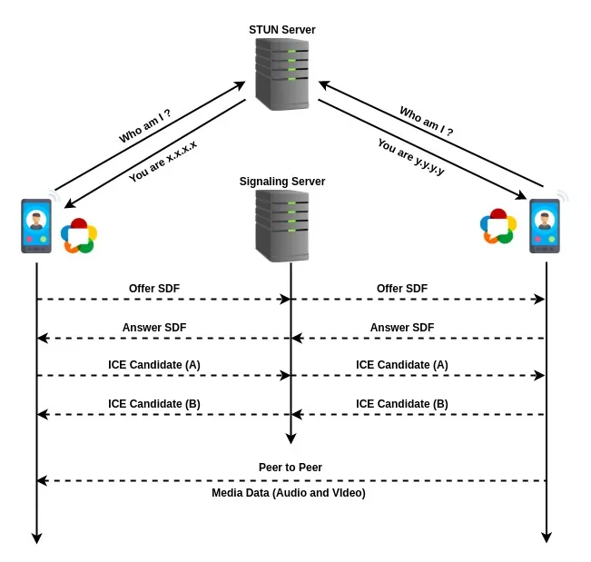
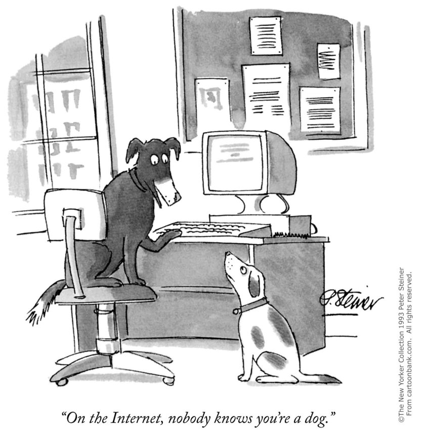
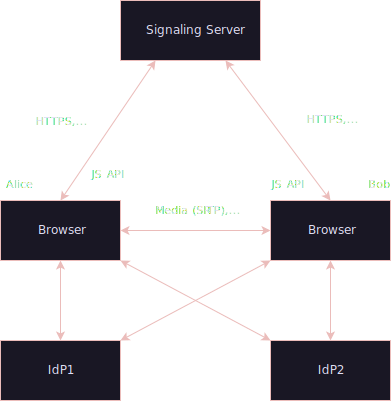

# Security in WebRTC Peer-To-Peer connections and knowing who you're talking to

Marc Matija
Hochschule RheinMain
2024-01-05

--- 

# Introduction

- Surge in applications like video conferencing, online collaboration, multiplayer gaming, and content sharing.
- Growing reliance on P2P technologies like WebRTC for direct, real-time data exchange.

<!--_footer: source: https://commons.wikimedia.org/-->

---

## What is ...

 ?

- A web standard enabling audio, video, and data transmission directly between browsers or clients without central servers.
- Enables Cross-Platform Peer-To-Peer connection
- Adopted in platforms like Big Blue Button, Zoom, and Discord.

<!--_footer: source: https://commons.wikimedia.org/wiki/File:WebRTC_Logo.svg-->

---

# Why use Peer-To-Peer?

- **Decentralization**: No need for a central server, reducing single points of failure and increasing reliability.
- **Reduced Latency**: Direct connections between peers minimize delays compared to routing through a server.
- **Scalability**: As the number of users grows, each new peer contributes to the network’s resources, enabling better scalability.
- **Cost Efficiency**: Reduces infrastructure costs by distributing the load across users, rather than relying on expensive server farms.

---

# Objectives  

**Presentation Goals**  
- Understand WebRTC’s architecture and security challenges.
- Understand how these challenges are solved.
- Highlight the risks involved with peer-to-peer.  
- Explore security mechanisms and mitigation strategies.  

---

## Core Components  
- **SDP (Session Description Protocol)**: Describes session information.
- **STUN (Session Traversal Utilities for NAT)**: Discovers public IP and port.  
- **TURN (Traversal Using Relays around NAT)**: Relays traffic when direct connections fail.  
- **ICE (Interactive Connectivity Establishment)**: Selects the best connection path.  
- **DTLS (Datagram Transport Layer Security)**: Encrypts data streams.  
- **SRTP (Secure Real-time Transport Protocol)**: Secures media streams.

---

## How WebRTC Works  

1. **Signaling**  
   - Exchanges SDP messages and ICE candidates.  
2. **NAT Traversal**  
   - Uses STUN and TURN for connectivity.  
3. **Connection Establishment**  
   - DTLS handshake for encryption.  
   - SRTP/SCTP for secure media and data transmission.

---

- **Find public IP and port using STUN**.
- **Exchange SDP (offer/answer)** 
- **Exchange ICE candidates.**
- **Connect to Peer**
  - Use TURN if direct connection fails

<!--_footer: source: https://commons.wikimedia.org/wiki/File:WebRTC_Logo.svg-->

---

# How to know, who to trust?
- Lack of central authority
- Anonymous nature of WebRTC
- Impersonation risks

<!--_footer: source: https://michaelmaslin.com/peter-steiner-20th-anniversary-on-internet-nobody-knows-youre-dog-2/-->

---

## The Trust Model in WebRTC  

- **Decentralized Trust Model:**  
  - WebRTC lacks a central authority to verify peers.  
  - Relies on the signaling server and cryptographic protocols.  
- **Goal:**  
  - Ensure the integrity, authenticity, and confidentiality of communication.

---

## Authenticated Entities  

- **Identity Providers (IdPs):**  
  - Provide credentials to verify the identity of peers.  
  - Use tokens to establish mutual trust.  
- **Signaling Server Trust:**  
  - Facilitates SDP and ICE exchange.  
  - Does not participate in media transmission.  
  - Secure signaling via HTTPS or WSS (WebSockets).

---

## Unauthenticated Entities

- **Challenges of Unauthenticated Entities:**
  - No direct verification of peer identity in many cases.  
  - Vulnerable to impersonation or unauthorized access.  
- **Examples:**
  - Public peer-to-peer gaming lobbies.  
  - Ad hoc WebRTC-based communication tools.  
- **Mitigation Strategies:**
  - Use of tokens or passphrases for peer verification.  
  - Regularly monitor TURN server activity.  
  - Implement rate-limiting to prevent abuse.

---

## Authentication ≠ Trust
- **Verifying identity** (e.g., Dr. Evil owns `example.org`) does not imply trustworthiness.  
- **User Decision:** Users must decide whether to grant access based on the authenticated entity.  
- **Temporary Trust:** Access to sensitive resources (e.g., camera/mic) should be *limited to context-specific use* (e.g., a single call).  
- **Identification as Prerequisite for Trust:** Policies depend on proper identification of network elements.  Identification enables informed trust decisions and policy application.

---

## Identification

**Challenges in Identification**
- **Dynamic Networks**: NATs and changing IPs hinder peer identification.
- **No Central Authority**: Decentralized model lacks built-in verification.
- **Impersonation Risks**: Malicious entities can mimic legitimate peers.
- **Context Matters**: Trust varies across use cases (e.g., public vs. private).
- **Security vs. Usability**: Balancing ease of use with strong identity checks.

---
<!--_footer: source: https://www.rfc-editor.org/rfc/rfc8827.html-->

## Role of Identity Providers (IdPs)

- Identity Verification: Cryptographic credentials ensure authenticity.
- Token-based Trust: Tokens exchanged for secure signaling.
- User Convenience: Trusted logins simplify identity management.
- Supports Decentralization: Maintains WebRTC’s P2P architecture.
- Enables Trust Decisions: Verified identities guide user trust.

---

# Authenticity and Data Integrity

- **End-to-End encryption by default**.

Protocols used for data security:
  - **DTLS**
  - **SRTP**

---

## DTLS (Datagram Transport Layer Security)
- **Encryption for Confidentiality**: Uses AES or ChaCha20 for secure data transmission.
- **Message Authentication**: Ensures integrity with HMAC (Hash-based Message Authentication Code).
- **Replay Protection**: Detects and rejects replayed packets using sequence numbers and timestamps.

---

## SRTP (Secure Real-time Transport Protocol)
- **Encryption for Confidentiality**: Encrypts media content using AES in Counter Mode.
- **Message Authentication**: Uses HMAC-SHA1 to verify integrity and prevent tampering.
- **Replay Protection**: Includes sequence numbers to prevent replay attacks.

---

# Potential Risks of WebRTC

- **IP Address Leakage**: WebRTC requires knowledge of a peer’s IP address, potentially exposing the user's location.
- **Risk of Location Exposure**: Even when using VPNs, WebRTC can leak:
  - Public IPv6 addresses
  - Temporary IPv6 addresses
  - Local and private addresses
- **Privacy Concerns**: VPNs aim to mitigate this, but WebRTC still leaks IP addresses in some scenarios.

---

## Mitigating Risks of WebRTC Leaks

- **Disabling WebRTC**: Turning off WebRTC in the browser to prevent leaks.
- **Disabling IPv6**: Reducing the scope of leaked information by disabling IPv6.
- **Using Relay Servers**: Sending data through a central server, though it negates the peer-to-peer nature of WebRTC.
- **No Perfect Solution**: Despite mitigations, WebRTC still inherently leaks IP addresses, sometimes even with VPN protection.

---

## Man-In-The-Middle Attacks in WebRTC

- **Vulnerable Signaling Process**: WebRTC requires signaling to establish connections, which can be intercepted by attackers.
- **Key Substitution & Impersonation**: Attackers can replace cryptographic fingerprints, tricking peers into connecting with the attacker instead of the intended peer.
- **Session Hijacking**: Attackers can modify SDP parameters to redirect traffic through malicious servers or hijack communication sessions.

---

# Mitigating MITM Attacks

- **Eavesdropping on Signaling**: Without encryption, attackers can intercept metadata like SDP messages, ICE candidates, and DTLS fingerprints.
- **Encrypted Signaling**: Protect signaling channels with encryption to prevent interception and manipulation.
- **Monitoring Media Path**: Regular checks for suspicious relays to detect MITM activity and secure the communication.

---

# Exploitation of Vulnerable TURN Servers

- **Bandwidth Drain Attacks**: Misconfigured TURN servers without authentication were used to relay high-volume traffic, leading to financial losses.
- **Abuse in Botnets**: Vulnerable servers were exploited to create resilient command-and-control (C&C) infrastructures, bypassing firewalls and NAT restrictions.
- **Sensitive Media Interception**: Lack of encryption on TURN servers allowed attackers to eavesdrop on real-time communications, especially on public cloud infrastructure.
- **Case Example – Slack’s Misconfigured TURN Servers**: Attackers exploited weak authentication to gain unauthorized access to internal services, bypassing network restrictions.

---

# Mitigating Risks of Vulnerable TURN Servers

- **Enforce Authentication**: Use strong authentication mechanisms, such as long-term credentials or OAuth tokens, with short expiration times.
- **Restrict Access**: Limit access to TURN servers by configuring firewalls and using rate-limiting to prevent abuse.
- **Encrypt Traffic**: Ensure TURN traffic is encrypted with protocols like DTLS or TLS.
- **Monitor Server Usage**: Regularly audit server logs for unusual patterns or unauthorized access attempts.
- **Secure Deployment**: Avoid hosting TURN servers on shared or insecure cloud environments; deploy in trusted locations.

---

# Conclusion

- **WebRTC’s Impact**: Revolutionized real-time communication with Peer-to-Peer architecture, reducing reliance on centralized servers.
- **Security Challenges**: Includes signaling vulnerabilities, IP address leaks, and the need for trust establishment.
- **Existing Solutions**: DTLS-SRTP and Identity Providers offer strong encryption and authentication, but vulnerabilities remain.
- **Future Directions**: Continued advancements in protocol design and heightened awareness of risks are needed to secure WebRTC for the modern web.

---

## Signaling Standards

WebRTC has no direct standard for the signaling protocol, however some popular options include

- Extensible Messaging and Presence Protocol (XMPP)
  - XMPP is an open-standard communication protocol that facilitates instant messaging and presence updates. 

- Session Initiation Protocol (SIP)
  -  SIP is a signaling protocol commonly used in telecommunications to establish, modify, and terminate multimedia sessions. 

- Custom REST API + WebSockets solution

---

## Extended Usages for WebRTC

- Real-Time Collaboration Tools
  - Example: Tools like **Google Docs** or **Miro (virtual whiteboard)** use WebRTC to synchronize changes made by users in real-time across different locations.

- Online Gaming (Real-Time Multiplayer)
  - Example: **Valve's [GameNetworkingSockets](https://github.com/ValveSoftware/GameNetworkingSockets)** library uses WebRTC for Peer-To-Peer multiplayer

- File Sharing and Data Transfer
  - Eliminating the need for a centralized file server. f.e. **[FilePizza](https://file.pizza)**, is a peer-to-peer file-sharing platform.

---

<!--_footer: source: https://www.enablesecurity.com/blog/slack-webrtc-turn-compromise-and-bug-bounty/
-->

## Slack's vulnerable Turn Servers

- Executive Summary
  - Vulnerability Identified: Slack’s TURN server allowed relaying of TCP connections and UDP packets to internal Slack network and AWS meta-data services.
  - Bug Bounty: $3,500 awarded for the discovery via HackerOne.
- Abuse of TURN: Slack's TURN server was used to relay traffic to:
  - AWS Meta-Data Services: Access IAM temporary credentials.
  - Internal Open Ports: Ports like 22, 25, 443, etc. on Slack’s internal servers.
  - Port Scanning: Scan internal IP range (10.41.0.0/16) for management applications.